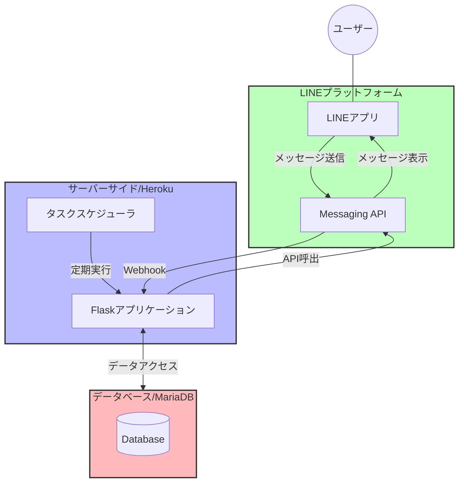
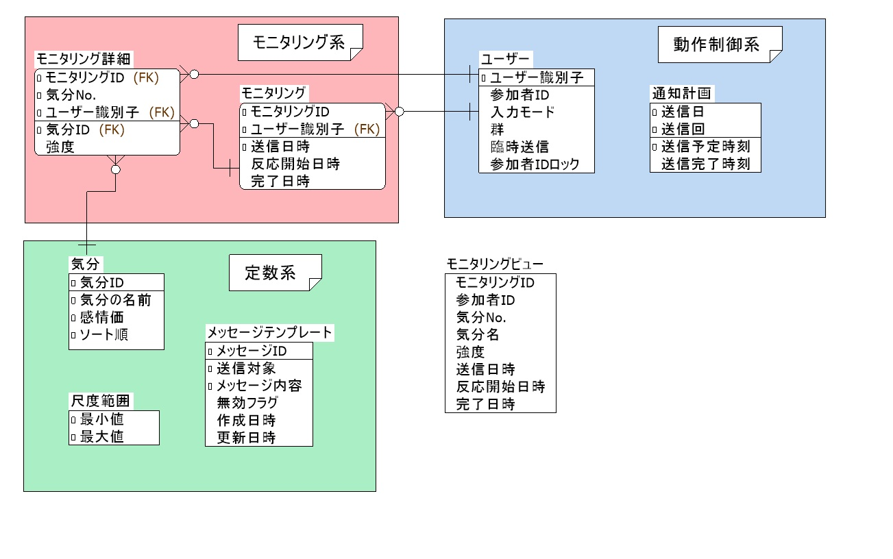

# EMI-Linebot

English version is [here](README_EN.md)

## 目次
- [EMI-Linebot](#emi-linebot)
  - [目次](#目次)
  - [概要](#概要)
  - [特徴](#特徴)
  - [主要機能](#主要機能)
  - [システムアーキテクチャ](#システムアーキテクチャ)
    - [1. LINEプラットフォーム](#1-lineプラットフォーム)
    - [2. サーバーサイド](#2-サーバーサイド)
    - [3. データベース](#3-データベース)
  - [起動トリガー](#起動トリガー)
  - [ディレクトリ構成](#ディレクトリ構成)
  - [環境構築手順](#環境構築手順)
    - [1. Gitリポジトリのクローン](#1-gitリポジトリのクローン)
    - [2. Herokuアカウントの作成とHeroku CLIのインストール](#2-herokuアカウントの作成とheroku-cliのインストール)
    - [3. Herokuアプリケーションの作成](#3-herokuアプリケーションの作成)
    - [4. データベースのセットアップ](#4-データベースのセットアップ)
    - [5. アプリケーションのデプロイ](#5-アプリケーションのデプロイ)
    - [6. LINE Botの設定](#6-line-botの設定)
    - [7. 環境変数の設定](#7-環境変数の設定)
    - [8. タスクスケジューラーの設定](#8-タスクスケジューラーの設定)
    - [9. ローカルでの起動方法](#9-ローカルでの起動方法)
  - [運用方法](#運用方法)
    - [参加者のLINE登録と参加者ID登録](#参加者のline登録と参加者id登録)
    - [LINE登録後の群の割り振り](#line登録後の群の割り振り)
    - [モニタリング開始後のモニタリング結果の閲覧](#モニタリング開始後のモニタリング結果の閲覧)
    - [手動メッセージ送信](#手動メッセージ送信)
    - [送信予定の確認](#送信予定の確認)
  - [設定を変更する場合](#設定を変更する場合)
    - [ユーザーの群設定の変更](#ユーザーの群設定の変更)
    - [感情語の変更](#感情語の変更)
    - [尺度範囲の変更](#尺度範囲の変更)
    - [臨時送信メッセージの変更](#臨時送信メッセージの変更)
    - [臨時送信対象ユーザーの変更](#臨時送信対象ユーザーの変更)
    - [データベース接続キャパシティの変更](#データベース接続キャパシティの変更)
    - [その他パラメーターの変更](#その他パラメーターの変更)
  - [ライセンス](#ライセンス)

## 概要

**EMI-Linebot** は、LINE上でユーザーが自身の気分や感情の変化をリアルタイムにモニタリングし、記録できる Ecological Momentary Intervention（EMI）システムです。ユーザーは、日常的に利用しているLINEアプリを通じて、気分や感情、それに伴う状況や反応などを簡単に記録することができます。


## 特徴

- **LINEプラットフォーム活用**  
  日常的に使用しているLINEアプリで、手軽に状態の記録が可能です。

- **データの多目的利用**  
  記録されたデータは、ユーザーのセルフモニタリングだけでなく、（ユーザーの同意を得た上で）研究データとしても活用できます。

## 主要機能

1. **ユーザー登録機能**

   * **ID登録**:ユーザーは「ID登録」と送信することで、参加者IDの登録を開始できます。「開始する」ボタンが押されると、ユーザーは参加者IDの入力を促されます。入力されたIDがデータベースに登録され、登録完了メッセージが送信されます。
   * **登録キャンセル**: 「やめる」ボタンが押されると、ID登録は中断されます。
   * **群の設定**: ID登録後、研究者はユーザーテーブルに参加者の群（0=統制群、1=実験群）を登録します。実験群にのみ、後述の自動通知が送信されます。 

2.  **気分モニタリング機能**

    * **自動通知送信:** ボットは10:00~22:00に1日3回、ランダムなタイミングでユーザーに対して現在の気分や感情を尋ねるメッセージと、複数の選択肢ボタン（感情語）を表示します。これらのボタンは90分間有効です。
    * **気分入力**:ユーザーが気分を選択すると、さらに追加の気分や感情を尋ねるメッセージと選択肢ボタンを表示します。ユーザーは繰り返し複数の気分を選択できます。
    * **気分の強度入力**:ユーザーが気分を選択すると、その気分をどの程度感じているかを尋ねるメッセージと、リッカート尺度による選択肢ボタン（デフォルトでは1～6）を表示します。
    * **状況/反応入力**:追加の気分入力を「なし」で終了した場合、乱数によって以下のいずれかの処理に分岐します。
        * 終了処理:選択された気分をまとめてユーザーに提示し、モニタリングを完了します。
        * 状況入力モード:気分に影響した状況の入力を促します。入力された状況は、まとめてユーザーに提示され、モニタリングが完了します。
        * 反応入力モード:気分に伴って生じた体の反応や行動の入力を促します。入力された反応は、まとめてユーザーに提示され、モニタリングが完了します。
    * **データベース連携**:ユーザー情報、気分モニタリング結果は、データベースに保存されます。一方で、状況や反応の記述結果は、要配慮個人情報を含む可能性があるため、保存は行っていません。
    * **ボタン操作に関する注意事項**:ボタンを押した後は、次のメッセージが表示されるまでお待ちください。ボタンを連打すると、データが正しく記録されない可能性があります。

3.  **手動メッセージ送信機能**
   
    * **プッシュメッセージ**:特定のグループに属するユーザーに対して、メッセージを送信する機能があります。メッセージの内容は、データベースに登録されたメッセージテンプレートに基づいて送信されます。メッセージの送信対象は、ユーザーテーブルで臨時送信フラグを有効にしたユーザーに限定されます。

## システムアーキテクチャ

本システムは以下の3つの主要コンポーネントで構成され、連携して動作します。



### 1. LINEプラットフォーム

- **対話インターフェース**  
  ユーザーとの対話を通じ、メッセージやボタン操作に応じた適切な応答・処理を実施します。

- **入力受付**  
  `modules/mood_buttons.py` や `modules/scale_buttons.py` により生成されたボタンやカルーセルを介して入力を受け付けます。

- **Webhook・API連携**  
  サーバーサイドへのWebhook POST送信、及びAPIリクエストでのメッセージ表示を行います。

### 2. サーバーサイド

- **実装環境**  
  Python と Flask を用いて実装され、Heroku上での運用を前提としています。

- **Webhookエンドポイント**  
  `main.py` 内の `/callback` エンドポイントが、LINE Botからの各種イベント（メッセージ、フォロー等）を受け取ります。

- **イベントハンドリング**  
  受信したイベントは、各ハンドラ（`handlers/follow_event_handler.py`、`handlers/message_event_handler.py`、`handlers/postback_event_handler.py`）へ振り分けられ、必要に応じてLINE BotにAPIリクエストを送信します。

### 3. データベース

- **運用環境**  
  Heroku上のMariaDBを使用することを想定しています。

- **テーブル構成**  
  動作制御、モニタリング結果、定数を管理する各種テーブルが存在し、DDLは `docs/create_table.sql` に記載されています。

- **アクセス方法**  
  データベースへのアクセスは、`infra/query.py` と `infra/service.py` 内の関数を通じて行います。 
  `infra/query.py` はデータの参照、`infra/service.py` はデータの追加・更新・削除を担います。

下図は、システムのERDを示しています。  
A5:SQL Mk-2で作成しており、ERDファイルも`docs/ERD.a5er`より使用可能です。  
モニタリング結果は正規化されているため、モニタリングビュー（`monitor_view`）を使用して閲覧すれば見やすいです。 



## 起動トリガー

1. **バッチ処理トリガー**

* 定期的に実行されるタスク（例：ユーザーへの通知送信）は、`triggers/scheduler.py` が担当します。
* Heroku Schedulerなどのタスクスケジューラによって、定期的に自動実行されます。
* `triggers/scheduler.py` 内部では、現在の時刻と送信予定時刻を比較し、送信対象となるユーザーに対してメッセージを送信する処理などが実装されています。

2. **手動実行トリガー**

* `triggers/manual_push.py` により、研究者が手動でメッセージを送信することができます。
* 特定のユーザーグループへのメッセージ送信や、テストメッセージの送信などに利用できます。
* メッセージ内容は、メッセージテンプレートテーブルで変更可能です。

3. **LINEのWebhookトリガー**

* ユーザーからの友達登録、ID登録、各種メッセージ送信、ボタン操作などのイベントを契機として、LINEプラットフォームからサーバーサイドのFlaskアプリケーションにWebhookが送信されます。
* 受信したWebhookイベントは、各ハンドラ（`handlers/follow_event_handler.py`、`handlers/message_event_handler.py`、`handlers/postback_event_handler.py`）で処理されます。
    * `handlers/follow_event_handler.py` は、友達登録イベントを処理し、ユーザー情報をデータベースに登録するなどの処理を行います。
    * `handlers/message_event_handler.py` は、ユーザーからのテキストメッセージを処理し、参加者IDの登録や、状況・反応入力モードにおけるユーザーからの入力を処理します。
    * `handlers/postback_event_handler.py` は、ボタン押下などのポストバックイベントを処理し、気分入力や強度入力などのユーザーからの応答をデータベースに記録します。

## ディレクトリ構成

```
├── main.py             # アプリケーションのエントリーポイント
├── constants.py        # システム全体で使用する定数の定義
├── requirements.txt    # 依存ライブラリのリスト
├── runtime.txt         # Pythonのバージョン指定
├── handlers            # LINE Botのイベントハンドラ
│   ├── follow_event_handler.py     # フォローイベント
│   ├── message_event_handler.py    # メッセージイベント
│   └── postback_event_handler.py   # ポストバックイベント
├── infra               # データベース操作関連のコード
│   ├── query.py        # データベースへのクエリ実行
│   ├── service.py      # データベースへのデータ操作
│   ├── db_util.py      # データベース接続用ユーティリティ
│   └── line_util.py    # LINE API接続用ユーティリティ
├── modules             # 機能を提供するモジュール
│   ├── button_generator.py # ボタン生成の原子コンポーネント
│   ├── id_registration.py # ユーザーID登録
│   ├── mood_buttons.py   # 気分選択ボタン生成
│   ├── mood_summarizer.py # 入力された気分と強度をサマリーして出力
│   └── scale_buttons.py  # 尺度選択ボタン生成
├── triggers            # サーバー側トリガーでLINEに通知する処理
│   ├── manual_push.py  # 手動プッシュ通知
│   └── scheduler.py    # 定期実行バッチ処理
├── docs                # ドキュメント
│   ├── ERD.a5er        # A5:SQL Mk-2に対応したERDファイル
│   ├── ERD.jpg         # ERD画像ファイル(物理名)
│   ├── ERD_JP.jpg      # ERD画像ファイル(論理名)
│   └── create_table.sql # テーブル作成DDL
```


## 環境構築手順

以下は、Herokuでのクラウド環境構築を前提とした手順です。

### 1. Gitリポジトリのクローン

1. ローカルにリポジトリをクローンします。

### 2. Herokuアカウントの作成とHeroku CLIのインストール

1. [Heroku公式サイト](https://www.heroku.com/)からアカウントを作成します。
2. [Heroku CLI](https://devcenter.heroku.com/articles/heroku-cli) をインストールし、ターミナルでログインします。

    ```bash
    heroku login
    ```

### 3. Herokuアプリケーションの作成

1. [Herokuダッシュボード](https://dashboard.heroku.com/)にアクセスし、「New」→「Create new app」をクリックします。

2. 以下の項目を入力します：
   - **App name**: ユニークなアプリ名を設定
   - **Region**: United States または Europe（日本からのアクセスの場合、United Statesを推奨）

3. 「Create app」をクリックしてアプリケーションを作成します。

4. アプリケーション作成後、「Deploy」タブでデプロイ方法を確認できます。
   - Heroku Git経由でのデプロイを推奨

5. 「Resources」タブで、Dynoタイプを設定します。
   - **本番運用の推奨**: Basic以上のDynoタイプを選択
   - ※ Ecoタイプは初回起動に時間がかかり、ユーザー体験を損ねる可能性が高いため非推奨です（試験環境を除く）

6. ローカルのGitリポジトリにHerokuリモートを追加します。
   ```bash
   # Herokuリモートの追加
   heroku git:remote -a <your-app-name>
   
   # リモートの確認
   git remote -v
   ```
   ※ `<your-app-name>` は手順2で設定したアプリ名に置き換えてください。

### 4. データベースのセットアップ

1. HerokuでMariaDBアドオンを追加します。
2. データベースユーザーに `SESSION_VARIABLES_ADMIN` 権限が付与されていることを確認してください。
3. `docs/create_table.sql` を使用して、テーブルを作成します。

### 5. アプリケーションのデプロイ

1. 変更内容をコミットします。

    ```bash
    git add .
    git commit -m "Initial commit"
    ```

2. Herokuリモートにプッシュしてデプロイします。

    ```bash
    git push heroku main
    ```

    ※ ブランチ名が `main` 以外の場合は適宜変更してください。


### 6. LINE Botの設定

1. [LINE Developersコンソール](https://developers.line.biz/)にログインし、対象のチャネルの設定画面に移動します。
2. **Webhook URL** に、Herokuで作成したアプリケーションのURLを設定します（例: `https://<your-app-name>.herokuapp.com/callback`）。
3. 必要に応じて、その他のLINE Messaging APIの設定を行ってください。

### 7. 環境変数の設定

1. Heroku CLIまたはダッシュボードから、環境変数を設定します。

    ```bash
    heroku config:set LINE_CHANNEL_ACCESS_TOKEN=<your-access-token>
    heroku config:set LINE_CHANNEL_SECRET=<your-channel-secret>
    heroku config:set DB_HOST=<your-db-host>
    heroku config:set DB_DATABASE=<your-db-name>
    heroku config:set DB_USERNAME=<your-db-username>
    heroku config:set DB_PASSWORD=<your-db-password>
    ```

2. ※ ローカルでの開発時は、プロジェクトルートに`.env`ファイルを作成し、必要な変数を定義してください。

### 8. タスクスケジューラーの設定

1. Heroku Schedulerアドオンをアプリに追加します。

2. Heroku Schedulerのダッシュボードにアクセスし、新しいジョブを作成します。
   - **コマンド**: `python triggers/scheduler.py`
   - **実行間隔**: 10分間隔
3. `triggers/scheduler.py` は自動で起動判定を行いますので、追加の設定は不要です。

### 9. ローカルでの起動方法

1. 依存ライブラリをインストールします。

    ```bash
    pip install -r requirements.txt
    ```

2. Flaskアプリケーションを起動します。

    ```bash
    python main.py
    ```

3. ローカル環境に対してLINE botのサーバーからWebhookを送信する場合は、[ngrok](https://ngrok.com/)などを用いてポートを公開してください。


## 運用方法

### 参加者のLINE登録と参加者ID登録

1. **LINE友だち登録**
   - 参加者にLINEの友だち追加用QRコードまたはLINE IDを共有
   - 参加者が友だち追加すると、自動的に`users`テーブルに基本情報が登録される
   - この時点では`group_id = 9`（未設定）、`participant_id = 'FILL'`の状態

2. **参加者ID登録**
   - 参加者が「ID登録」とメッセージを送信
   - システムが登録モードに移行し、参加者IDの入力を要求
   - 参加者が4桁の参加者IDを入力
   - システムが`users`テーブルの`participant_id`を更新

3. **参加者IDの更新ロック**
   - `users`テーブルで参加者IDの更新可否を管理しており、初期状態では参加者IDは更新可能（`is_participant_id_locked = 0`）
   - 参加者IDが正しく登録されたことを確認後、IDをロック（`is_participant_id_locked = 1`）に設定
   - ロック後は参加者からの「ID登録」メッセージに対して「IDはすでに登録されています。」と応答
   - これにより、実験途中でのID変更を防止し、データの一貫性を確保

※ 参加者IDの更新ロックは、データの追跡可能性を維持するための重要な機能です。実験開始前に、全参加者のIDが正しく登録され、ロックされていることを確認してください。

### LINE登録後の群の割り振り

1. **事前準備**
   - 実験計画に基づき、参加者IDと群の割り当て（0=統制群、1=実験群）を事前に決定
   - 乱数等を用いて、参加者を統制群と実験群に割り付け
   - 割り付け結果を記録したリストを用意

2. **群の設定**
   - 事前に決定した群を`users`テーブルに設定
   - 更新後、該当の群向けのモニタリング通知が、`notification_plans`テーブル（日次で自動更新）に沿って自動送信される

※ 群の設定は実験の重要な要素であり、参加者への通知送信に直接影響するため、事前の割り付けリストと照合しながら慎重に行ってください。

### モニタリング開始後のモニタリング結果の閲覧

1. **モニタリングビューの利用**
   - `monitor_view`を使用して、モニタリング結果を閲覧

2. **データのエクスポート**
   - モニタリングビューから必要なデータをCSV形式でエクスポート（※本アプリの対象外）
   - 統計解析やデータ可視化に活用

### 手動メッセージ送信

実験前の説明、実験中のリマインド、実験後のお礼など、必要に応じて参加者に手動でメッセージを送信できます。

1. **メッセージテンプレートの準備**
   - `message_templates`テーブルに送信したいメッセージを登録
   - 統制群（`target_group = 0`）と実験群（`target_group = 1`）で異なるメッセージを設定可能
   - 各群で有効なメッセージは1つのみ（`is_disabled = 0`）

2. **送信対象の設定**
   - `users`テーブルの`is_temporary_send`フラグで送信対象を制御
   - 送信したい参加者のフラグを有効化

3. **メッセージの送信**
   - Herokuコンソールもしくはローカルのターミナルから、`triggers/manual_push.py`を実行してメッセージを送信
   ```bash
   # 統制群のみに送信
   python triggers/manual_push.py --control
   
   # 実験群のみに送信
   python triggers/manual_push.py --experimental
   
   # 両群に送信
   python triggers/manual_push.py --both
   ```
   
   オプションの説明：
   - `--control`: 統制群（group_id = 0）のみにメッセージを送信
   - `--experimental`: 実験群（group_id = 1）のみにメッセージを送信
   - `--both`: 両方の群にメッセージを送信
   
   ※ いずれかのオプションを必ず指定する必要があります。

4. **使用例**
   - 実験開始前：実験の説明や注意事項の送信
   - 実験中：回答率が低下した参加者へのリマインド
   - 実験後：お礼メッセージの送信、フィードバック希望の確認

※ メッセージ送信前に、必ずテスト用アカウントで内容と送信対象の確認を行ってください。

### 送信予定の確認

実験群への自動通知は、`notification_plans`テーブルで管理されています。

1. **送信予定の生成タイミング**
   - 日付が変わった時点で、その日の3回分の送信予定時刻が自動生成されます
   - 送信時刻は以下のルールで生成されます：
     - 1回目：10:00～15:00の間でランダム
     - 2回目：1回目の3時間後以降（～18:00）でランダム
     - 3回目：2回目の3時間後以降（～21:00）でランダム

2. **送信予定の確認方法**
   - `notification_plans`テーブルで確認可能
   - 主な項目：
     - `sending_date`: 送信予定日
     - `sending_time`: 送信予定時刻
     - `sent_time`: 実際の送信完了時刻
       - 未送信の場合は`NULL`
       - 送信完了後は実際の送信時刻が記録
     - `sending_number`: 送信回（1=1回目、2=2回目、3=3回目）

3. **送信状況の監視**
   - 送信予定時刻の前後10分が送信可能時間帯
   - 送信完了時刻（`sent_time_*`）が記録されていれば送信成功
   - 送信エラーはHerokuのログで確認可能
   - `notification_plans`テーブルを編集することで、送信予定を変更可能

※ 送信予定の時間帯や間隔を変更する場合は、`constants.py`の設定を変更してください。

## 設定を変更する場合

### ユーザーの群設定の変更

ユーザーの群設定は、データベースの `users` テーブルで管理されています。

- 群の種類
  - 統制群（group_id = 0）：通知が送信されないグループ
  - 実験群（group_id = 1）：通知が送信されるグループ
  - 未設定（group_id = 9）：初期状態

※ 群の変更は、ユーザーへの通知送信に直接影響するため、慎重に行う必要があります。

### 感情語の変更

感情語の設定は、データベースの `moods` テーブルで管理されています。以下の操作が可能です：

- 新しい感情語の追加
- 既存の感情語の名称変更
- 感情語の削除
- 感情価の変更
  - 1=Positive：ポジティブな感情
  - 2=Negative：ネガティブな感情
  - 3=Neutral：中性的な感情
  - 88=Separator：セパレータ（区切り線）
  - 99=None：「なし」ボタン
  - ※ セパレータと「なし」ボタンを表示するには、それぞれ感情価を88と99に設定する必要があります。これらの値を適切に設定しないと、区切り線や「なし」ボタンが表示されません。
- 表示順序の制御
  - `sort_order`カラムで感情語の表示順序を制御
  - 数値が小さい順に表示
  - セパレータを使用することで、感情語グループ間に区切り線を表示可能

感情語を変更する際は、既存のモニタリングデータとの整合性に注意してください。

### 尺度範囲の変更

尺度の範囲は、データベースの `scale_ranges` テーブルで管理されています。

- デフォルトでは1-6の範囲が設定されています
- 最小値と最大値を変更可能
- 変更後は新規モニタリングから新しい尺度が適用されます

### 臨時送信メッセージの変更

臨時送信メッセージは、データベースの `message_templates` テーブルで管理されています。
`triggers/manual_push.py`で手動メッセージ送信時に使用されます。

- 統制群・実験群それぞれに対して個別のメッセージを設定可能
- メッセージの追加・編集・無効化が可能
- 各メッセージには有効/無効フラグがあり、送信対象を制御できます
- 群ごとに有効にできるメッセージは1つのみ

### 臨時送信対象ユーザーの変更

臨時送信対象ユーザーは、データベースの `users` テーブルで管理されています。
`triggers/manual_push.py`で送信対象の判定に使用されます。

- 個別のユーザーを送信対象に設定/解除可能
- 送信対象の設定は `is_temporary_send` フラグで管理

### データベース接続キャパシティの変更

参加者の増加に伴って、データベースのパフォーマンスを調整する場合、`constants.py`で以下のパラメータを変更してください。
これらの設定はデータベースのコネクションプールのキャパシティを規定しています。

 - 最小接続数（`DB_MIN_CONNECTIONS`、デフォルト：1）
 - 最大接続数（`DB_MAX_CONNECTIONS`、デフォルト：5）
 - コネクション共有数（`DB_MAX_SHARED`、デフォルト：1）
 - 接続タイムアウト（`DB_CONNECTION_TIMEOUT`、デフォルト：30秒）

### その他パラメーターの変更

`constants.py` で以下の設定を変更可能です：

1. 通知時間帯
   - 最早開始時刻（`SCHEDULER_MIN_HOUR`、デフォルト：10時）
   - 最早終了時刻（`SCHEDULER_MAX_HOUR`、デフォルト：15時）
     - 最遅終了時刻は、`SCHEDULER_MAX_HOUR` + `SCHEDULER_MIN_INTERVAL_HOURS` * 2となります（デフォルト：21時）

2. スケジューラー関連
   - バッチ実行間隔（`SCHEDULER_BATCH_MINUTES`、デフォルト：10分）
     - Heroku Schedulerの設定と一致させる必要があります
   - 通知間の最小間隔（`SCHEDULER_MIN_INTERVAL_HOURS`、デフォルト：3時間）
   - 通知時刻の分の最小値（`SCHEDULER_MIN_MINUTES`、デフォルト：0分）
   - 通知時刻の分の最大値（`SCHEDULER_MAX_MINUTES`、デフォルト：59分）

3. ボタンの設定
   - 有効期限（`BUTTON_EXPIRY_MINUTES`、デフォルト：90分）

4. 強度レベルの閾値
   - 低強度（`INTENSITY_LOW`、デフォルト：2）
   - 中強度（`INTENSITY_MEDIUM`、デフォルト：4）
   - 高強度（`INTENSITY_HIGH`、デフォルト：5）
     - 「少し」「やや」「かなり」「強く」を振り分ける境界値になります

5. 入力モード（`handlers/message_event_handler.py`で使用）
   - ニュートラル（`INPUT_MODE_NEUTRAL`、デフォルト：0）
   - ID登録開始（`INPUT_MODE_ID_REGISTRATION`、デフォルト：1）
   - ID登録確認（`INPUT_MODE_CONFIRMATION`、デフォルト：2）
   - 状況入力（`INPUT_MODE_SITUATION`、デフォルト：3）
   - 反応入力（`INPUT_MODE_REACTION`、デフォルト：4）

6. 参加者IDロック（`handlers/message_event_handler.py`で使用）
   - ロック無効（`ID_UNLOCKED`、デフォルト：0）
   - ロック有効（`ID_LOCKED`、デフォルト：1）
   - ロック状態は`users`テーブルの`is_participant_id_locked`で管理
   - ロック有効時は参加者IDの変更が禁止され、「ID登録」メッセージに対して警告を表示

これらの設定を変更する際は、システムの動作に影響を与える可能性があるため、テスト環境での十分な検証を推奨します。また、複数の設定を変更する場合は、設定間の整合性にも注意を払ってください。

## ライセンス

このプロジェクトは[MITライセンス](LICENSE)の下で公開されています。