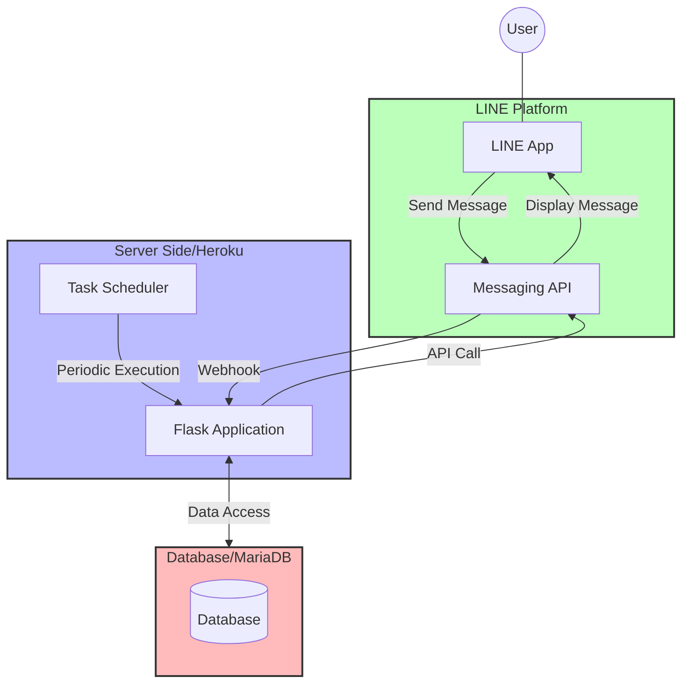
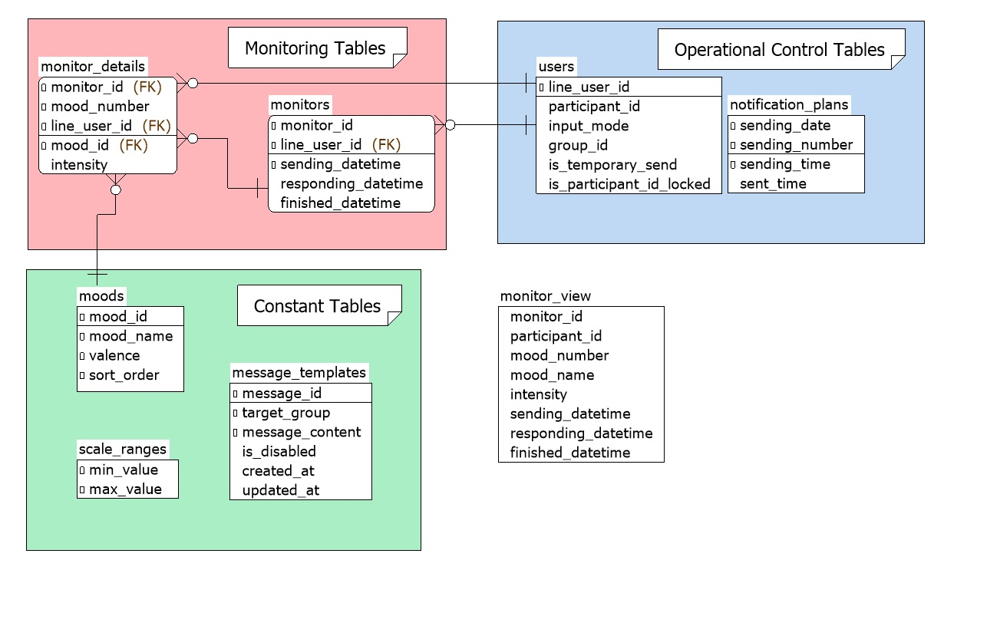

# EMI-Linebot

日本語版は[こちら](README.md)

## Table of Contents
- [EMI-Linebot](#emi-linebot)
  - [Table of Contents](#table-of-contents)
  - [Overview](#overview)
  - [Features](#features)
  - [Main Features](#main-features)
  - [System Architecture](#system-architecture)
    - [1. LINE Platform](#1-line-platform)
    - [2. Server Side](#2-server-side)
    - [3. Database](#3-database)
  - [Activation Triggers](#activation-triggers)
  - [Directory Structure](#directory-structure)
  - [Environment Setup Steps](#environment-setup-steps)
    - [1. Clone the Git Repository](#1-clone-the-git-repository)
    - [2. Create a Heroku Account and Install the Heroku CLI](#2-create-a-heroku-account-and-install-the-heroku-cli)
    - [3. Create the Heroku Application](#3-create-the-heroku-application)
    - [4. Setup the Database](#4-setup-the-database)
    - [5. Deploy the Application](#5-deploy-the-application)
    - [6. Configure the LINE Bot](#6-configure-the-line-bot)
    - [7. Set Environment Variables](#7-set-environment-variables)
    - [8. Configure the Task Scheduler](#8-configure-the-task-scheduler)
    - [9. Running Locally](#9-running-locally)
  - [Operation](#operation)
    - [User Registration for LINE and Participant ID Registration](#user-registration-for-line-and-participant-id-registration)
    - [Group Assignment After LINE Registration](#group-assignment-after-line-registration)
    - [Viewing Monitoring Results After Monitoring Starts](#viewing-monitoring-results-after-monitoring-starts)
    - [Manual Message Sending](#manual-message-sending)
    - [Checking Scheduled Messages](#checking-scheduled-messages)
  - [Modifying Settings](#modifying-settings)
    - [Changing User Group Settings](#changing-user-group-settings)
    - [Modifying Emotion Words](#modifying-emotion-words)
    - [Changing Scale Range](#changing-scale-range)
    - [Modifying Temporary Message Content](#modifying-temporary-message-content)
    - [Changing Temporary Message Target Users](#changing-temporary-message-target-users)
    - [Changing Database Connection Capacity](#changing-database-connection-capacity)
    - [Modifying Other Parameters](#modifying-other-parameters)
  - [License](#license)

## Overview

**EMI-Linebot** is an Ecological Momentary Intervention (EMI) system enabling users to monitor and record their moods and emotional changes via LINE. Users can easily log their moods, emotions, and related contexts or reactions using the widely adopted LINE app.


## Features

- **Utilization of the LINE Platform**  
 Easily record your status using the familiar LINE app.

- **Multipurpose Data Usage**  
 The recorded data can be used for user self-monitoring and, with consent, as research data.

## Main Features

1. **User Registration Feature**

   * **ID Registration (ID登録)**: Users can initiate participant ID registration by sending the message "ID Registration (ID登録)." When the "Start (開始する)" button is pressed, the user is prompted to enter a participant ID. The entered ID is saved to the database, and a registration confirmation message is sent.
   * **Registration Cancellation (登録キャンセル)**: Pressing the "Cancel (やめる)" button aborts the registration process.
   * **Group Assignment**: After ID registration, researchers assign users to a group (0 = control group, 1 = experimental group) in the `users` table. Only users in the experimental group will receive the automatic notifications described later.

2. **Mood Monitoring Feature**

   * **Automated Notification Sending**: The bot sends messages asking about the user's current mood or emotion three times a day at random times between 10:00 and 22:00. These messages include multiple selection buttons (emotion words) that remain active for 90 minutes.
   * **Mood Input**: When a mood is selected, an additional message is displayed asking for further details with additional selection buttons. Users can repeatedly select multiple moods.
   * **Mood Intensity Input**: After selecting a mood, the user is prompted to indicate the intensity of that mood using a Likert scale (default range: 1-6).
   * **Situation/Reaction Input**: If additional mood input is terminated with a selection of "None (なし)," one of the following processes is randomly chosen:
      * **Completion Process**: The selected moods are summarized and presented to the user, concluding the monitoring session.
      * **Situation Input Mode**: The user is prompted to input the situation that affected their mood. The input is summarized in association with the selected emotions and presented, ending the monitoring session.
      * **Reaction Input Mode**: The user is prompted to input any bodily reactions or behaviors resulting from their mood. The input is summarized in association with the selected emotions and presented, completing the monitoring session.
   * **Database Integration**: User information and mood monitoring results are stored in the database. However, descriptions of situations or reactions--which may contain sensitive personal data--are not stored.
   * **Note on Button Operations**: After pressing a button, please wait for the next message to appear. Rapid button presses may result in improper data recording.

3. **Manual Message Sending Feature**

   * **Push Messaging**: The system can send messages to users within specific groups. Message content is based on templates stored in the database. It is sent only to users who are flagged for temporary messaging in the `users` table.

## System Architecture

The system is composed of three main components that work together:



### 1. LINE Platform

- **Interactive Interface**  
 Handles interactions with users by providing appropriate responses and processing button actions.

- **Input Reception**  
 Receives inputs through buttons and carousels generated by `modules/mood_buttons.py` and `modules/scale_buttons.py`.

- **Webhook and API Integration**  
 Sends webhook POST requests to the server side and displays messages via API calls.

### 2. Server Side

- **Implementation Environment**  
 Developed with Python and Flask and designed to run on Heroku.

- **Webhook Endpoint**  
 The `/callback` endpoint in `main.py` receives various events (messages, follow events, etc.) from the LINE Bot.

- **Event Handling**  
 Incoming events are dispatched to specific handlers (`handlers/follow_event_handler.py`, `handlers/message_event_handler.py`, `handlers/postback_event_handler.py`), which then send API requests to the LINE Bot as required.

### 3. Database

- **Operational Environment**  
 Designed to use a MariaDB instance on Heroku.

- **Table Structure**  
 Various tables manage operational controls, monitoring results, and constants. The DDL is provided in `docs/create_table.sql`.

- **Access Method**  
 Database operations are performed via functions in `infra/query.py` (for data retrieval) and `infra/service.py` (for data insertion, update, and deletion).

The diagram below shows the system's ERD.  
Created using A5:SQL Mk-2, the ERD file is available from `docs/ERD.a5er`.  
Since the monitoring results are normalized, viewing them through the `monitor_view` is recommended for clarity.



## Activation Triggers

1. **Batch Process Trigger**

* Periodic tasks (e.g., sending notifications) are managed by `triggers/scheduler.py`.
* These tasks are automatically executed regularly via a scheduler like Heroku Scheduler.
* Within `triggers/scheduler.py`, the current time is compared with scheduled send times to determine which users should receive messages.

2. **Manual Execution Trigger**

* Researchers can manually send messages using `triggers/manual_push.py`.
* This is used for sending messages to specific user groups or for test messages.
* Message content is based on templates stored in the `message_templates` table.

3. **LINE Webhook Trigger**

* Events such as friend additions, ID registrations, various message sends, and user button presses trigger webhooks from the LINE Platform to the Flask application on the server side.
* Received webhook events are processed by respective handlers:
    * `handlers/follow_event_handler.py` handles friend addition events and registers user information in the database.
    * `handlers/message_event_handler.py` processes text messages from users (e.g., participant ID registration or inputs during situation/reaction modes).
    * `handlers/postback_event_handler.py` handles postback events from button presses, recording mood inputs and intensity levels in the database.

## Directory Structure

```
├── main.py             # Application entry point
├── constants.py        # Definitions of system-wide constants
├── requirements.txt    # List of dependency libraries
├── runtime.txt         # Python version specification
├── handlers            # LINE Bot event handlers
│   ├── follow_event_handler.py     # Follow event handler
│   ├── message_event_handler.py    # Message event handler
│   └── postback_event_handler.py   # Postback event handler
├── infra               # Code related to database operations
│   ├── query.py        # Executes database queries
│   ├── service.py      # Handles data insertion, updates, and deletions
│   ├── db_util.py      # Database connection utilities
│   └── line_util.py    # Utilities for LINE API connections
├── modules             # Modules providing various functionalities
│   ├── button_generator.py # Basic component for generating buttons
│   ├── id_registration.py    # User ID registration
│   ├── mood_buttons.py       # Mood selection button generation
│   ├── mood_summarizer.py    # Summarizes, and outputs entered moods and intensity levels
│   └── scale_buttons.py      # Scale selection button generation
├── triggers            # Server-side triggers for sending notifications to LINE
│   ├── manual_push.py      # Manual push notifications
│   └── scheduler.py        # Batch processing for periodic execution
├── docs                # Documentation
│   ├── ERD.a5er          # ERD file for A5:SQL Mk-2
│   ├── ERD.jpg           # ERD image file
│   ├── ERD_JP.jpg        # ERD image file in Japanese
│   └── create_table.sql  # DDL for table creation
```

## Environment Setup Steps

The following steps assume you are setting up a cloud environment on Heroku.

### 1. Clone the Git Repository

Clone the repository locally.

### 2. Create a Heroku Account and Install the Heroku CLI

Create an account on the [Heroku official website](https://www.heroku.com/).

Install the [Heroku CLI](https://devcenter.heroku.com/articles/heroku-cli) and log in via your terminal.

```bash
heroku login
```

### 3. Create the Heroku Application

Go to the [Heroku Dashboard](https://dashboard.heroku.com/) and create new app.

Fill in the following:

- **App name**: Set a unique application name.
- **Region**: Choose the United States or Europe (the United States is recommended for access from Japan).

Click "Create app" to create your application.

After creation, check the deployment method under the "Deploy" tab.

Deploying via Heroku Git is recommended.

In the "Resources" tab, configure the Dyno type.

- **Recommended for production**: Choose a Dyno type of Basic or higher.
- Note: The Eco type is not recommended (except in testing environments) as it may delay initial startup and affect user experience.

Add the Heroku remote to your local Git repository.

```bash
# Add Heroku remote
heroku git:remote -a <your-app-name>

# Verify remotes
git remote -v
```

Replace `<your-app-name>` with the app name you set in step 2.

### 4. Setup the Database

Add the MariaDB add-on in Heroku.

Ensure the database user is granted the `SESSION_VARIABLES_ADMIN` privilege.

Use `docs/create_table.sql` to create the necessary tables.

### 5. Deploy the Application

Commit your changes.

```bash
git add .
git commit -m "Initial commit"
```

Deploy by pushing to the Heroku remote.

```bash
git push heroku main
```

Change the branch name if it is not `main` as appropriate.

### 6. Configure the LINE Bot

Log in to the [LINE Developers Console](https://developers.line.biz/) and navigate to the settings page of your channel.

Set the Webhook URL to your Heroku application URL (e.g., `https://<your-app-name>.herokuapp.com/callback`).

Configure additional LINE Messaging API settings as needed.

### 7. Set Environment Variables

Using the Heroku CLI or Dashboard, set the environment variables:

```bash
heroku config:set LINE_CHANNEL_ACCESS_TOKEN=<your-access-token>
heroku config:set LINE_CHANNEL_SECRET=<your-channel-secret>
heroku config:set DB_HOST=<your-db-host>
heroku config:set DB_DATABASE=<your-db-name>
heroku config:set DB_USERNAME=<your-db-username>
heroku config:set DB_PASSWORD=<your-db-password>
```

Create a `.env` file in the project root for local development and define the necessary variables.

### 8. Configure the Task Scheduler

Add the Heroku Scheduler add-on to your app.

Access the Heroku Scheduler dashboard and create a new job.

- **Command**: `python triggers/scheduler.py`
- **Frequency**: Every 10 minutes

`triggers/scheduler.py` automatically determines when to execute, so no further configuration is necessary.

### 9. Running Locally

Install the required libraries.

```bash
pip install -r requirements.txt
```

Start the Flask application.

```bash
python main.py
```

To receive webhooks from the LINE bot server on your local machine, use a tool like ngrok to expose your local port.

## Operation

### User Registration for LINE and Participant ID Registration

1. **Adding as a LINE Friend (友だち登録)**
   - Share the LINE friend-addition QR code or LINE ID with participants.
   - Once added as a friend (友だち登録), basic information is automatically registered in the `users` table.
   - At this stage, `group_id` is set to 9 (unset), and `participant_id` is marked as 'FILL.'

2. **Participant ID Registration (ID登録)**
   - The participant sends the message "ID Registration (ID登録)."
   - The system enters registration mode and prompts for the participant ID.
   - The participant enters a 4-character alphanumeric participant ID.
   - The system updates the `participant_id` field in the `users` table.

3. **Participant ID Update Lock**
   - The `users` table manages whether the participant ID can be updated; by default, it is updatable (`is_participant_id_locked = 0`).
   - After confirming that the participant ID has been correctly registered, the system locks the ID (`is_participant_id_locked = 1`).
   - Once locked, any "ID Registration (ID登録)" messages will trigger the response "ID is already registered (IDはすでに登録されています。)."
   - This prevents mid-experiment ID changes and ensures data consistency.

 Note: Locking the participant ID is crucial for maintaining data traceability. Ensure all participant IDs are registered and locked before starting the experiment.

### Group Assignment After LINE Registration

1. **Preparation**
   - Based on the experimental plan, pre-determine the assignment of participant IDs to groups (0 = control group, 1 = experimental group).
   - Use randomization (e.g., random numbers) to assign participants to the control and experimental groups.
   - Prepare a list with the assignment results.

2. **Group Setting**
   - Set the groups in the `users` table according to the pre-determined assignment.
   - After updating, monitoring notifications will be automatically sent according to the `notification_plans` table (which updates daily) for the respective group.

 Note: Group assignment is critical for the experiment and directly affects notification delivery. Verify assignments carefully against the pre-determined list.

### Viewing Monitoring Results After Monitoring Starts

1. **Using the Monitoring View**
   - View monitoring results via the `monitor_view`.

2. **Data Export**
   - Export necessary data in CSV format from the monitoring view (this feature is outside the scope of the application).
   - Use the exported data for statistical analysis or data visualization.

### Manual Message Sending

Manual message sending can be performed as needed--for pre-experiment instructions, in-experiment reminders, or post-experiment thank-you messages.

1. **Preparing Message Templates**
   - Register messages in the `message_templates` table.
   - Different messages can be set for the control group (`target_group = 0`) and the experimental group (`target_group = 1`).
   - Only one active message per group is allowed (`is_disabled = 0`).

2. **Setting the Target Users**
   - Control the target audience via the `is_temporary_send` flag in the `users` table.
   - Enable the flag for the participants you wish to target.

3. **Sending the Message**
   - To send messages, execute `triggers/manual_push.py` from the Heroku console or local terminal.

```bash
# Send only to the control group
python triggers/manual_push.py --control

# Send only to the experimental group
python triggers/manual_push.py --experimental

# Send to both groups
python triggers/manual_push.py --both
```

Options:

- `--control`: Sends messages only to the control group (`group_id = 0`)
- `--experimental`: Sends messages only to the experimental group (`group_id = 1`)
- `--both`: Sends messages to both groups

Note: You must specify one of these options.

4. **Usage Examples**
   - Before the experiment: Send instructions and guidelines.
   - During the experiment: Remind participants with low response rates.
   - After the experiment: Send thank-you messages and request feedback.

 Always test message content and target settings with a test account before sending it to all participants.

### Checking Scheduled Messages

Automated notifications for the experimental group are managed via the `notification_plans` table.

1. **Generation Timing of Scheduled Messages**
   - Three scheduled send times for each day are automatically generated when the date changes.
   - The sending times are generated based on the following rules:
    - First notification: Random time between 10:00 and 15:00.
    - Second notification: Random time at least 3 hours after the first (up to 18:00).
    - Third notification: Random time at least 3 hours after the second (up to 21:00).

2. **How to Check Scheduled Messages**
   - Examine the `notification_plans` table.
   - Key fields include:
    - `sending_date`: Scheduled send date.
    - `sending_time`: Scheduled send time.
    - `sent_time`: Actual time of message delivery.
      - NULL if not yet sent.
      - The actual send time once the message is delivered.
    - `sending_number`: Notification number (1 = first, 2 = second, 3 = third).

3. **Monitoring the Send Status**
   - The allowable send window is 10 minutes before and after the scheduled send time.
   - A recorded `sent_time` indicates successful delivery.
   - Any errors can be reviewed in the Heroku logs.
   - You can modify scheduled send times by editing the `notification_plans` table.

 Note: To change the scheduled time windows or intervals, adjust the settings in `constants.py`.

## Modifying Settings

### Changing User Group Settings

User group settings are managed in the `users` table.

- **Group Types**:
  - Control Group (`group_id = 0`): Users in this group do not receive notifications.
  - Experimental Group (`group_id = 1`): Users in this group receive notifications.
  - Unset (`group_id = 9`): Default initial state.

 Note: Changes to group assignments directly affect notification delivery; proceed with caution.

### Modifying Emotion Words

Emotion words are managed in the `moods` table. The following operations are supported:

- Adding new emotion words.
- Renaming existing emotion words.
- Deleting emotion words.
- Changing emotion values:
  - 1 = Positive (positive emotions)
  - 2 = Negative (negative emotions)
  - 3 = Neutral (neutral emotions)
  - 88 = Separator (divider)
  - 99 = None (represents the "None (なし)" button)

 Note: To display a separator or the "None (なし)" button, set the emotion values to 88 and 99, respectively. Incorrect settings will prevent these from appearing.

- Controlling display order:
  - The `sort_order` column determines the display order.
  - Emotion words are shown in ascending order.
  - Separators can be used to divide groups of emotion words visually.

 When modifying emotion words, ensure consistency with existing monitoring data.

### Changing Scale Range

The scale range is managed in the `scale_ranges` table.

- The default range is 1-6.
- You can change the minimum and maximum values.
- The new scale will be applied to monitoring sessions from the point of change onward.

### Modifying Temporary Message Content

Temporary messages are managed in the `message_templates` table and used by `triggers/manual_push.py` for manual messaging.

- Separate messages can be set for the control group and the experimental group.
- You can add, edit, or turn off messages.
- Each message has an active/inactive flag to control delivery.
- Only one active message per group is permitted.

### Changing Temporary Message Target Users

Temporary message target users are managed in the `users` table and are used by `triggers/manual_push.py` to determine the target audience.

- Individual users can be added to or removed from the target list.
- This is managed via the `is_temporary_send` flag.

### Changing Database Connection Capacity

If participant numbers increase and you need to adjust database performance, modify the following parameters in `constants.py`. These settings determine the capacity of the database connection pool:

  - Minimum connections (`DB_MIN_CONNECTIONS`, default: 1)
  - Maximum connections (`DB_MAX_CONNECTIONS`, default: 5)
  - Maximum shared connections (`DB_MAX_SHARED`, default: 1)
  - Connection timeout (`DB_CONNECTION_TIMEOUT`, default: 30 seconds)

### Modifying Other Parameters

Additional settings in `constants.py` can be modified as follows:

1. **Notification Time Window**
   - Earliest start time (`SCHEDULER_MIN_HOUR`, default: 10)
   - Earliest end time (`SCHEDULER_MAX_HOUR`, default: 15)
    - The latest end time is calculated as `SCHEDULER_MAX_HOUR` + `SCHEDULER_MIN_INTERVAL_HOURS` * 2 (default: 21)

2. **Scheduler Settings**
   - Batch execution interval (`SCHEDULER_BATCH_MINUTES`, default: 10 minutes)
    - This must match the Heroku Scheduler configuration.
   - Minimum interval between notifications (`SCHEDULER_MIN_INTERVAL_HOURS`, default: 3 hours)
   - Minimum minute value for notification time (`SCHEDULER_MIN_MINUTES`, default: 0)
   - Maximum minute value for notification time (`SCHEDULER_MAX_MINUTES`, default: 59)

3. **Button Settings**
   - Button expiry duration (`BUTTON_EXPIRY_MINUTES`, default: 90 minutes)

4. **Intensity Level Thresholds**
   - Low intensity (`INTENSITY_LOW`, default: 2)
   - Medium intensity (`INTENSITY_MEDIUM`, default: 4)
   - High intensity (`INTENSITY_HIGH`, default: 5)
    - These thresholds categorize intensity levels (e.g., "slight", "moderate", "considerable", and "strong").

5. **Input Modes (used in `handlers/message_event_handler.py`)**
   - Neutral (`INPUT_MODE_NEUTRAL`, default: 0)
   - ID Registration Start (`INPUT_MODE_ID_REGISTRATION`, default: 1)
   - ID Registration Confirmation (`INPUT_MODE_CONFIRMATION`, default: 2)
   - Situation Input (`INPUT_MODE_SITUATION`, default: 3)
   - Reaction Input (`INPUT_MODE_REACTION`, default: 4)

6. **Participant ID Lock (used in `handlers/message_event_handler.py`)**
   - Unlocked (`ID_UNLOCKED`, default: 0)
   - Locked (`ID_LOCKED`, default: 1)
   - The lock status is managed by the `is_participant_id_locked` field in the `users` table.
   - When locked, changes to the participant ID are prohibited, and a warning is displayed upon receiving an "ID Registration (ID登録)" message.

When modifying these settings, thoroughly test in a staging environment, as changes can impact system behavior. Also, consistency among settings should be ensured if multiple parameters are changed.

## License

This project is released under the [MIT License](LICENSE).